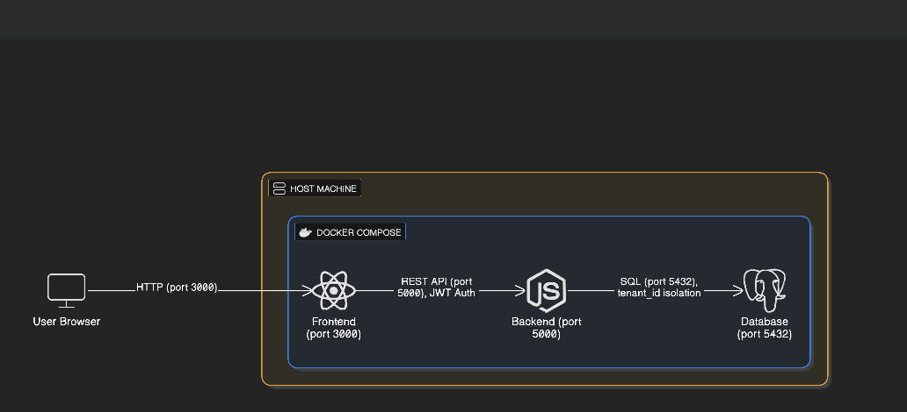
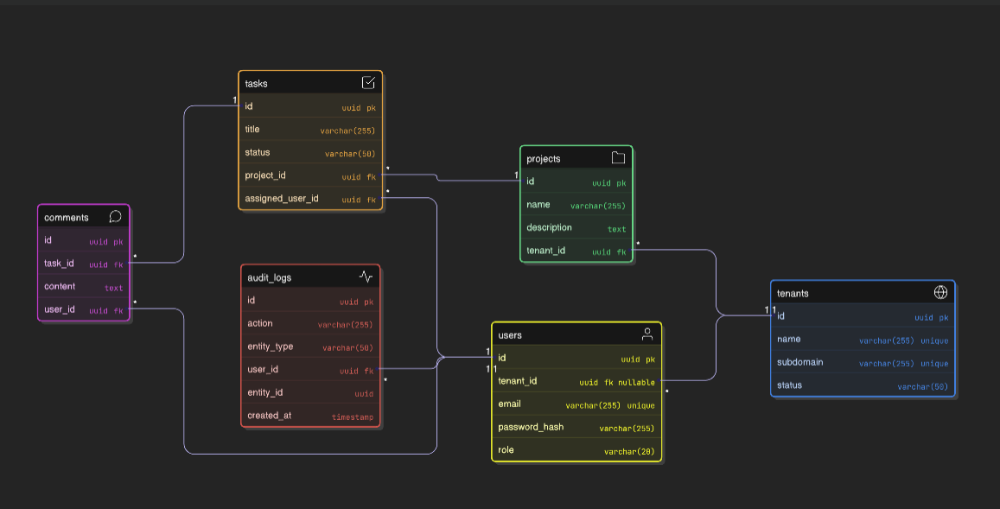

# Multi-Tenant SaaS Platform

A production-ready multi-tenant SaaS application built with React, Node.js, Express, and PostgreSQL.

## 🚀 Quick Start

### Prerequisites
- Docker
- Docker Compose

### Run the Application

```bash
docker compose up -d --build
```

This single command will:
1. Start PostgreSQL database
2. Run database migrations
3. Seed demo data
4. Start backend API server (port 5000)
5. Start frontend React app (port 3000)

### Access the Application

**Frontend:** http://localhost:3000

**Backend API:** http://localhost:5000/api/health

## 🔐 Test Credentials

### Tenant: `demo`

**Admin Account:**
- Email: `admin@demo.com`
- Password: `Password@123`

**Regular Users:**
- Email: `user1@demo.com` / Password: `Password@123`
- Email: `user2@demo.com` / Password: `Password@123`

### Super Admin (No Tenant Required)
- Email: `superadmin@system.com`
- Password: `Password@123`

## 📋 Features

- ✅ Multi-tenant architecture with complete data isolation
- ✅ JWT-based authentication
- ✅ Role-based access control (Super Admin, Tenant Admin, User)
- ✅ Project management
- ✅ Task management with Kanban board
- ✅ User profile management
- ✅ Responsive modern UI
- ✅ RESTful API backend
- ✅ PostgreSQL database with migrations
- ✅ Docker containerization

## 🏗️ Architecture

```
├── backend/              # Node.js + Express API
│   ├── src/
│   │   ├── controllers/  # Business logic
│   │   ├── routes/       # API endpoints
│   │   ├── middleware/   # Auth, error handling
│   │   └── server.js     # Entry point
│   ├── migrations/       # Database schema
│   └── seeds/            # Demo data
├── frontend/             # React + Vite
│   └── src/
│       ├── components/   # Reusable UI components
│       ├── pages/        # Page components
│       └── utils/        # API client, auth
└── docker-compose.yml    # Container orchestration
```
## System Architecture


## Database Schema (ER Diagram)


## 🛠️ Tech Stack

**Frontend:**
- React 18
- React Router
- Axios
- Vite

**Backend:**
- Node.js
- Express.js
- JWT
- bcrypt

**Database:**
- PostgreSQL 15

**DevOps:**
- Docker
- Docker Compose

## 📡 API Endpoints

### Authentication
- `POST /api/auth/login` - User login

### Projects
- `GET /api/projects` - List projects
- `POST /api/projects` - Create project
- `GET /api/projects/:id` - Get project
- `PUT /api/projects/:id` - Update project
- `DELETE /api/projects/:id` - Delete project

### Tasks
- `GET /api/projects/:projectId/tasks` - List tasks
- `POST /api/projects/:projectId/tasks` - Create task
- `PUT /api/tasks/:id` - Update task
- `DELETE /api/tasks/:id` - Delete task

### Users
- `GET /api/tenants/:tenantId/users` - List users
- `POST /api/tenants/:tenantId/users` - Create user
- `PUT /api/users/:id` - Update user
- `DELETE /api/users/:id` - Delete user

### Tenants
- `GET /api/tenants` - List tenants (super admin)
- `GET /api/tenants/:id` - Get tenant
- `PUT /api/tenants/:id` - Update tenant

## 🔧 Development

### Stop the Application
```bash
docker compose down
```

### View Logs
```bash
docker compose logs -f
```

### Rebuild
```bash
docker compose up -d --build
```

## 📦 Database Schema

**Tenants** - Organization accounts
**Users** - User accounts with roles
**Projects** - Project management
**Tasks** - Task tracking with status
**Comments** - Task comments
**Audit Logs** - System activity tracking

## 🔒 Security Features

- Password hashing with bcrypt
- JWT token authentication
- Role-based access control
- Tenant data isolation
- SQL injection protection
- CORS configuration

## 📝 License

MIT License - see LICENSE file for details

## 🤝 Support

For issues and questions, please open an issue in the repository.

---

**Built with ❤️ for multi-tenant SaaS applications**
